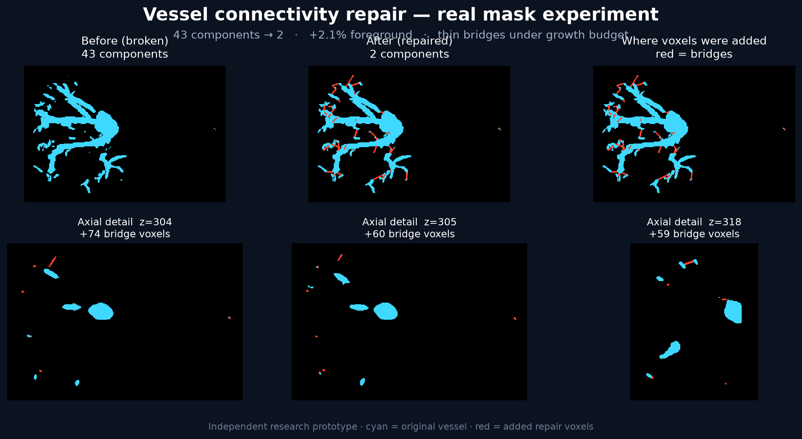
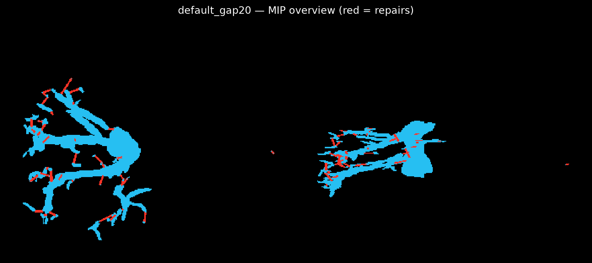
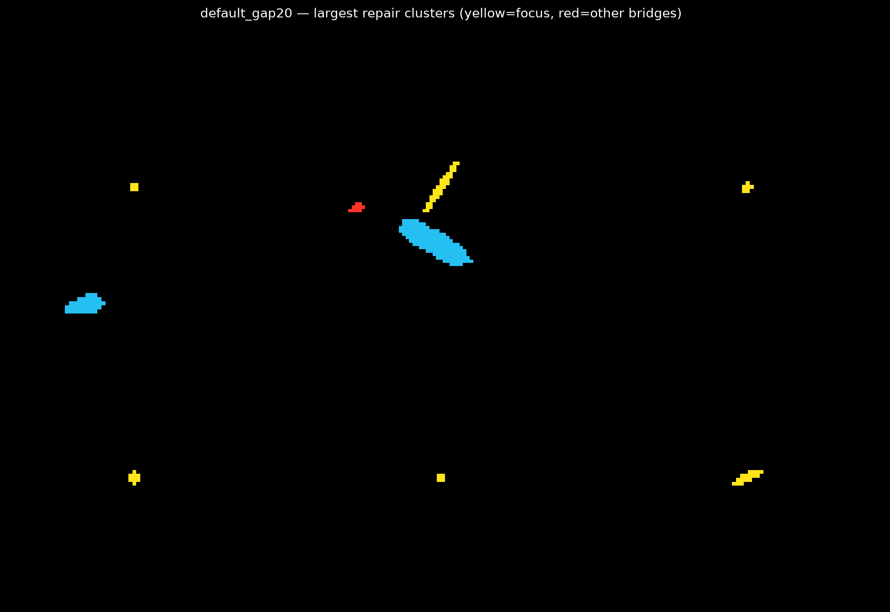

# Vessel connectivity repair (paper-inspired prototype)

Broken vessel segmentations are a quiet killer for anything that needs a centerline, a branch graph, or a connected overlay in a viewer. A mask can look fine on Dice and still fall apart into dozens of components because of a one-voxel gap.

I read **[Mind the Gap: Mesh-Guided Repair of Broken Vessels](https://arxiv.org/abs/2609.29779)** (Drwiega, Szymanski, Wodzinski — Sano / AGH) and liked the problem framing: keep a binary vessel mask, use a geometric prior, and reconnect components with thin bridges under a foreground-growth budget.

Public author code was not available when I tried this. I gave the paper description to **GPT-6 Astra** and built a small research prototype from that description alone. **This repo is an independent, unofficial experiment** — not affiliated with the paper authors, and not their implementation.

> Focus here is only a practical connectivity-repair stage (components → thin bridges → growth checks → optional cleanup). The paper’s full mesh decoder / FOMAML / template pipeline is **not** included. Please cite the paper for the ideas; use this repo only as a starting point for your own experiments.

Write-up on the PYCAD side: [Broken vessel mask in, connected overlay out](https://pycad.co/blog/broken-vessel-mask-in-connected-overlay-out-centerlines-graphs/).


## Visual results (real vessel mask)

Independent experiment on a single-class clinical vessel mask (not from the paper authors). Cyan = original foreground, red = voxels added by repair.



**Same case — MIP overview** (repairs in red):



**Largest bridge clusters (close-ups):**



On this example: **43 → 2** connected components with about **2.1%** added foreground (default settings). Always QC bridges visually on your own data.


## What it does

**Input:** binary vessel NIfTI (or any `>0` foreground)  
**Output:** repaired binary NIfTI with local tubular bridges, same geometry (spacing / origin / direction)

Prior used here: nearest **boundary-endpoint** pairs in physical mm (KD-tree), straight thin tubes, accept only if components merge and cumulative added voxels stay under a max foreground-growth fraction. Optional island filter / small-component cleanup.

On a real single-class vessel mask I tried: **43 → 2** connected components with ~2% foreground growth (default settings). Your mileage will vary — always QC the bridges visually.

## Install

```bash
git clone https://github.com/amine0110/vessel-connectivity-repair.git
cd mind-the-gap-vessel-repair
python -m venv .venv
source .venv/bin/activate   # Windows: .venv\Scripts\activate
pip install -r requirements.txt
# or: pip install -e .
```

Python 3.10+. CPU only — NumPy / SciPy / scikit-image / NiBabel.

## Quick demo (synthetic broken mask)

```bash
python scripts/run_demo.py
# or
python -m vessel_repair.cli --demo --outdir demo_out
```

## Repair your own mask

```bash
python -m vessel_repair.cli \
  --input broken.nii.gz \
  --output repaired.nii.gz \
  --tube-radius-mm 1.0 \
  --max-added-fg-fraction 0.05 \
  --max-gap-mm 20.0 \
  --cleanup
```

| Flag | Default | Meaning |
|---|---:|---|
| `--tube-radius-mm` | 1.0 | Bridge tube radius (mm) |
| `--max-added-fg-fraction` | 0.05 | Max added voxels / original foreground |
| `--max-gap-mm` | 20.0 | Max endpoint gap to consider (mm) |
| `--filter-island-mm` | 0 | Drop islands farther than this from the largest component (0 = off) |
| `--min-component-size` | 1 | Cleanup size threshold |
| `--cleanup` | off | Remove tiny leftovers after bridging |

The CLI prints JSON with before/after component counts, voxels added, and accepted bridge lengths.

## Relation to the paper (unofficial)

See [PAPER_NOTES.md](PAPER_NOTES.md) for a short method digest. Roughly:

| Paper (§2.4) | This unofficial prototype |
|---|---|
| Fitted deformable mesh as scaffold | Simpler distance / boundary prior |
| Mesh-graph or endpoint + mesh validation | Endpoint pairs + growth gate |
| Thin tube + max FG growth | Same idea |
| FOMAML / GCN decoder / Tables 1–2 | Not included |

If you need production topology repair, wait for (or rebuild) the authors’ mesh-guided path — and validate on your own protocol.

## Citation

Please cite the original work if you use these ideas:

```bibtex
@article{drwiega2026mindthegap,
  title   = {Mind the Gap: Mesh-Guided Repair of Broken Vessels},
  author  = {Drwiega, Gniewosz and Szymanski, Wojciech and Wodzinski, Marek},
  journal = {arXiv preprint arXiv:2609.29779},
  year    = {2026}
}
```

Paper: https://arxiv.org/abs/2609.29779 · PDF: https://arxiv.org/pdf/2609.29779

## Disclaimer

Research software for experimentation and education. **Not** a medical device. Do not use for clinical decisions without your own validation, senior review of bridge sites, and appropriate regulatory path.


—
Mohammed El Amine Mokhtari ([@amine0110](https://github.com/amine0110)) · [PYCAD](https://pycad.co)
